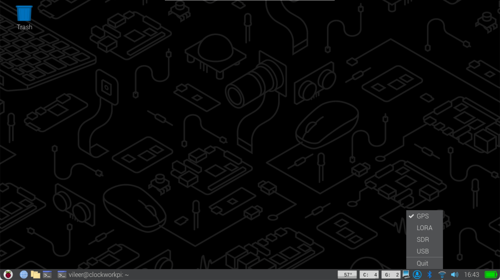

# aiov2_ctl

A lightweight **power and feature control client** for the HackerGadgets **AIO v2** board (GPIO-based fork).

This version controls onboard hardware (GPS, LoRa, SDR, USB power rails) via **direct GPIO access using `pinctrl`**, and supports both **CLI** and **system tray GUI** modes.

---

## What this tool does

`aiov2_ctl` directly toggles GPIO pins mapped to hardware enable lines in order to:

- Enable / disable hardware modules
- Query current on/off state
- Provide a tray-based GUI for quick toggling

---

## Requirements

- Debian / Raspberry Pi OS (Bookworm / Trixie recommended)
- Python 3.9+
- Raspberry Pi–compatible board with GPIO access
- Hardware wired so that feature enable lines are connected to GPIO pins
- `pinctrl` available on the system

---

## 1) System dependencies

Install required system packages:

sudo apt update  
sudo apt install -y python3 python3-pip python3-pyqt6 git  

---

## 2) Install aiov2_ctl (system-wide, no virtualenv)

Recommended install location is `/opt`.

sudo git clone https://github.com/hackergadgets/aiov2_ctl.git /opt/aiov2_ctl  
cd /opt/aiov2_ctl  
sudo pip3 install --break-system-packages -r requirements.txt  

Sanity check:

sudo python3 /opt/aiov2_ctl/aiov2_ctl.py  

---

## 3) CLI usage

View current status of all features:

python3 aiov2_ctl.py  

Enable or disable a feature:

python3 aiov2_ctl.py <FEATURE> <on|off>  

Supported features:

- GPS
- LORA
- SDR
- USB

Examples:

Turn ON GPS  
python3 aiov2_ctl.py GPS on  

Turn OFF LoRa  
python3 aiov2_ctl.py LORA off  

---

## 4) Optional: global command

Create a convenience wrapper so the tool can be run from anywhere:

sudo tee /usr/local/bin/aiov2ctl >/dev/null <<'EOF'  
#!/usr/bin/env bash  
exec python3 /opt/aiov2_ctl/aiov2_ctl.py "$@"  
EOF  

sudo chmod +x /usr/local/bin/aiov2ctl  

Usage:

aiov2ctl status  
aiov2ctl SDR off  

---

## 5) GUI mode (system tray)

Start the tray-based GUI:

python3 aiov2_ctl.py --gui  

A system tray icon will appear.  
Right-click the icon to toggle features on or off.

---

## 6) Autostart GUI on login (recommended)

For desktop systems, use **XDG autostart**.

mkdir -p ~/.config/autostart  
nano ~/.config/autostart/aiov2_ctl.desktop  

Paste:

[Desktop Entry]  
Type=Application  
Name=AIO v2 Controller  
Comment=AIO v2 tray controller  
Exec=python3 /opt/aiov2_ctl/aiov2_ctl.py --gui  
Terminal=false  
X-GNOME-Autostart-enabled=true  

Save and reboot.

---

## Optional: delay GUI startup

If GPIO or desktop services initialize slowly, change `Exec=` to:

Exec=bash -c "sleep 5 && python3 /opt/aiov2_ctl/aiov2_ctl.py --gui"

---

## Notes

- This fork uses **direct GPIO control** via `pinctrl`
- `pinctrl` access typically requires elevated privileges
- GUI autostart runs as the logged-in user; GPIO permissions may need adjustment (udev / sudoers)

---

## License

Same license as the original repository.
